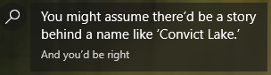
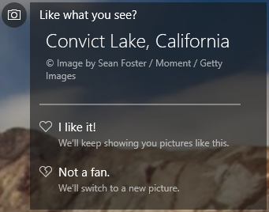

# Remove Windows lock screen/Spotlight Ads
Remove Windows lock screen/Spotlight ads while keeping the rotating Spotlight image backgrounds. **The effect is immediate, there is no restart or logoff required.**


This script parses the JSON configuration for Spotlight, located in `%LOCALAPPDATA%`, to remove the buzzfeed-esque ads that clutter the lock screen.
<p align="center">
  
</p>

By default the image credits are kept. Pass `--remove-credits` if you would like them removed, too.
<p align="center">
  
</p>

## Usage
```
usage: removeads.py [-h] [-v] [--dry-run] [--remove-credits] (--once | --watch | --install | --uninstall) [path]

positional arguments:
  path              Path to file or directory to remove lock screen ads from.

optional arguments:
  -h, --help        show this help message and exit
  -v, --verbose     Enable verbose logging
  --dry-run         Process and log but do not modify files
  --remove-credits  Remove the image credits box

actions:
  --once            Remove ads from file(s) in path
  --watch           Continue running, watch directory for new Spotlight files, and remove ads from them
  --install         Start in --watch mode on login
  --uninstall       Remove installed files and login task
```
